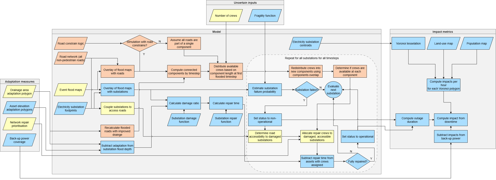

[TODO]-[DOI]

# PowerPath
## A critical infrastructure risk, resilience, and adaptation model
This repository contains a time‑explicit disruption and recovery model to represent the coupled behaviour of electricity substations and the road network during and after a flooding event. The model simulates, at each timestep, flood exposure, substation failure, road accessibility, repair crew allocation, and recovery, and translates these processes into spatially distributed impacts

### MIRACA
This work has received funding from the European Union’s Horizon Europe research and innovation programme under grant agreement No. 101093854 for the project ‘Multi-hazard Infrastructure Risk Assessment for Climate Adaptation’ [MIRACA] (https://miraca-project.eu) is a research project building an evidence-based decision support toolkit that meets real world demands.
