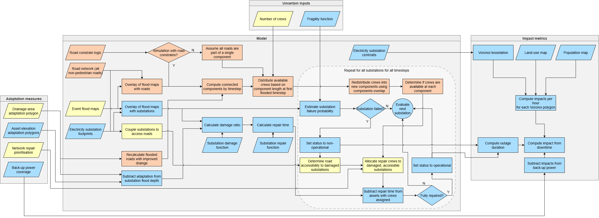

](https://doi.org/10.5281/zenodo.20731868)

# PowerPath
## A critical infrastructure risk, resilience, and adaptation model
This repository contains a time‑explicit disruption and recovery model to represent the coupled behaviour of electricity substations and the road network during and after a flooding event. The model simulates, at each timestep, flood exposure, substation failure, road accessibility, repair crew allocation, and recovery, and translates these processes into spatially distributed impacts

### Shared realised-state cache (societal access)
Societal-access postprocessing supports an optional shared realised-state cache for cross-experiment reuse in multiprocessing/distributed runs.

Configure in `societal_access_config`:

- `shared_realized_state_cache_config.enabled`: enable shared caching
- `shared_realized_state_cache_config.backend`: currently `sqlite`
- `shared_realized_state_cache_config.path`: shared database path
- `shared_realized_state_cache_config.namespace`: logical run namespace
- `shared_realized_state_cache_config.schema_version`: cache schema/version fence
- `shared_cache_fail_hard`: if `True`, raise on backend errors; if `False`, fallback to normal computation

The realised-state key is label-invariant with respect to raw island ID renumbering.

For reproducible benchmark telemetry from CLI (sequential vs multiprocessing; cache on/off), run:

`python -m src.benchmark_realized_state_cache --factory <module>:<function> --scenarios 10 --n-processes 4 --out-json /tmp/realized_cache_benchmark.json --out-csv /tmp/realized_cache_benchmark.csv`

Factory function contract:
- returns a dict with `model` and `policies`
- may optionally include `uncertainty_sampling`
- `model` must include EMA constant `societal_access_config`

### MIRACA
This work has received funding from the European Union’s Horizon Europe research and innovation programme under grant agreement No. 101093854 for the project ‘Multi-hazard Infrastructure Risk Assessment for Climate Adaptation’ [MIRACA] (https://miraca-project.eu) is a research project building an evidence-based decision support toolkit that meets real world demands.

